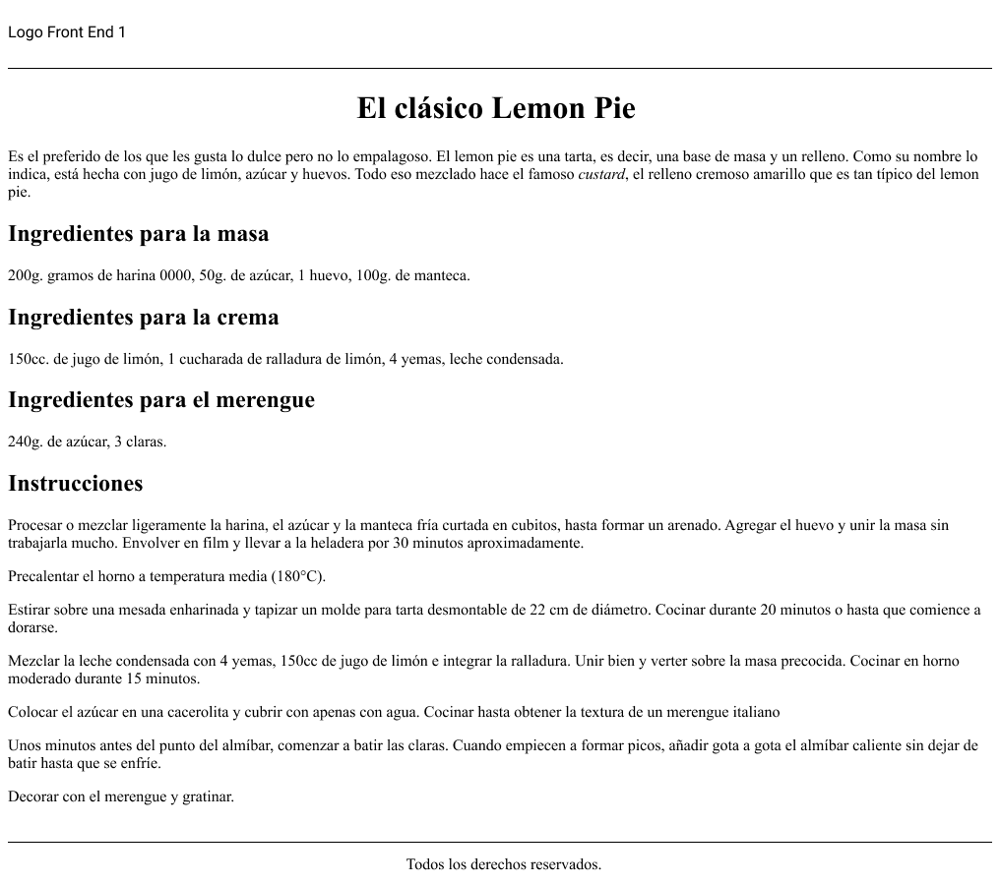

# Desafío Clase 03

Utilizando este diseño de [figma](https://www.figma.com/file/VvU8uV8583MiWfeMTmw4Cy/Clase-04---Introducci%C3%B3n-a-HTML?type=design&node-id=0-1&mode=design&t=ToMV0qAZVsQ8MC8u-0) como fuente de datos, la idea será reconocer cuáles podrían ser los diferentes elementos o etiquetas que corresponden a ese resultado visual. Una vez hecho esto, tu tarea será trasladar aquello que idearon utilizando etiquetas HTML.

**Importante**
El proceso de reconocer las diferentes etiquetas o elementos puede ser por fuera del código. Es decir, pueden tomar nota en papel, escribiendo por encima de la imagen si es que la imprimen o simplemente utilizando algún software para poder escribir o dibujar sobre la imagen.

**Para finalizar**
Antes de concentrarnos en el código, un ejercicio interesante es comprender cuáles serán los elementos que necesitaremos para estructurar un sitio. Esto nos dará la posibilidad de tomar decisiones fáciles de modificar ya que, una vez hecho esto, el proceso de estructurar HTML será solo insertar etiquetas con sus valores correspondientes.

**Observaciones**
Aunque aún no se ha visto a profundidad el lenguaje de estilos CSS, se puede hacer uso de estilos básicos en "*línea*" para lograr una apariencia lo más cercano posible al diseño propuesto.

[Resultado aquí](./code/index.html)

