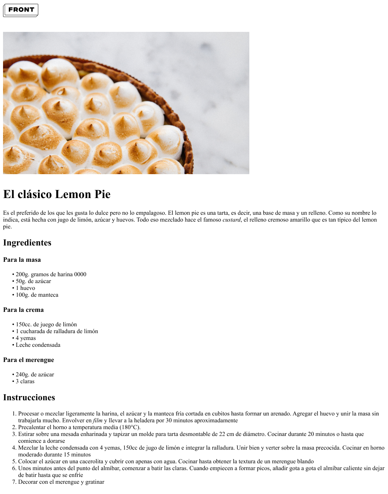

# Desafío Clase 04

Utilizando del siguiente [figma](https://www.figma.com/file/E8Orh57Weqm2a4UuU4nmdT/Clase-05---Etiquetas?type=design&node-id=101-2&mode=design&t=ue8rhiAWeIjoMyyM-0), la idea será reconocer cuáles podrían ser los diferentes elementos o etiquetas que corresponden a ese resultado visual. Una vez hecho esto, su tarea será trasladar aquello que idearon utilizando etiquetas HTML.

**Importante**

El proceso de reconocer las diferentes etiquetas o elementos puede ser por fuera del código. Es decir, pueden tomar nota en papel, escribiendo por encima de la imagen si es que la imprimís o simplemente utilizando algún software para poder escribir o dibujar sobre la imagen.

[Resultado aquí](./sync/code/index.html)

