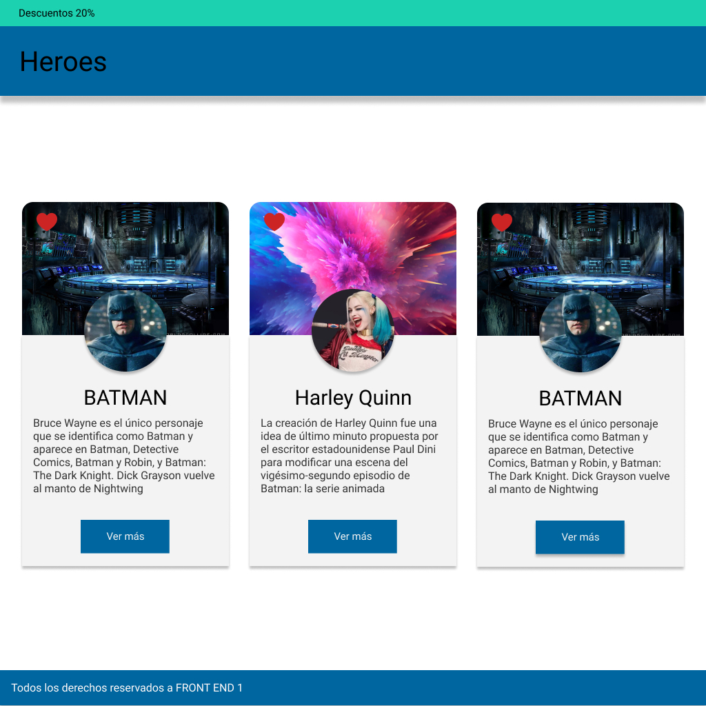

# Desafío Clase 07

## Desafío:

Utilizando el siguiente diseño desarrollado Figma:

Se pide revisar los diferentes elementos y estilos que corresponden a ese resultado visual y maquetarlo.  

Por el momento usaremos las propiedades del modelo de caja vistas en clase para poder maquetarlo. La barra azul del Header deberá quedar fija en la parte superior al hacer scroll en la página.