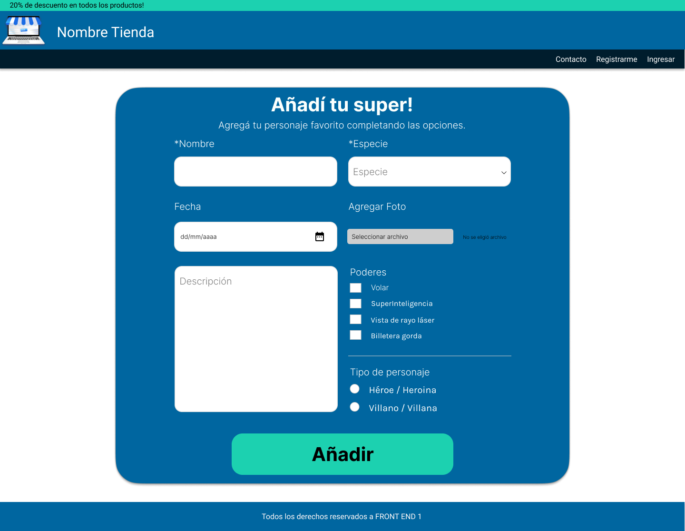

# Desafío Clase 11

## Desafío 11: Trabajando con formularios

Se solicita crear el maquetado con los conocimientos adquiridos hasta el momento y aplicando los conceptos de la creación de formularios visto en clase.

El objetivo es desarrollar una recreación lo más cercana posible a los siguientes diseños:
  

**Formualrio de registro de super héroe**

