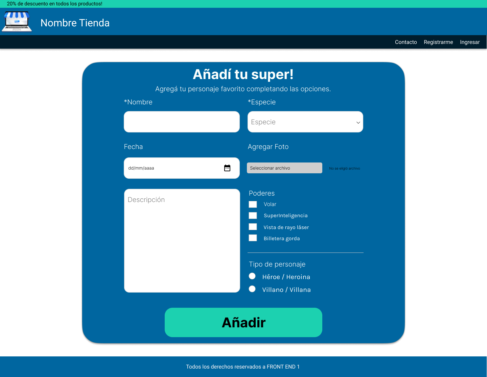

# Desafío Clase 12

## Pseudo-Clases | Pseudo-Elementos

La tarea para esta clase es dar interactividad con CSS utilizando los conceptos vistos en la clase asincrónica.

El objetivo principal es utilizar los pseudoselectores y pseudoelementos que permitan lograr la interactividad que presenta el boceto.
  

**Formualrio de registro de super héroe**

