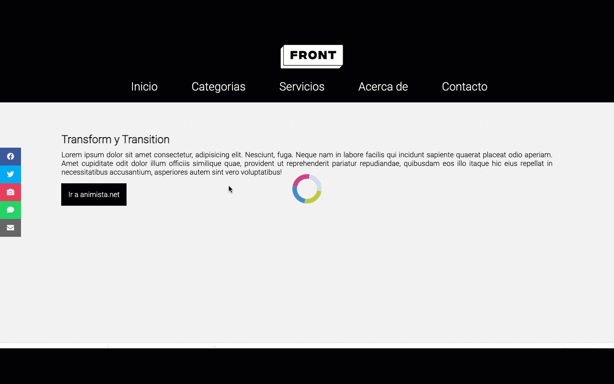

# Desafío Clase 13

## Desafío:

En esta oportunidad, utilizaremos un proyecto base y realizaremos las modificaciones necesarias para que se vea como el GIF compartido.

Utilizaremos el proyecto base para maquetar un sitio teniendo en cuenta los siguientes pasos:
1. Crea enlaces de menú
2. Menú íconos sociales
3. Aplicar animaciones en:
   * Botones de Redes Sociales
   * Menú de navegación
   * Loader
   * Botón
4. Considerar cuándo usar :hover, transform y keyframes.
