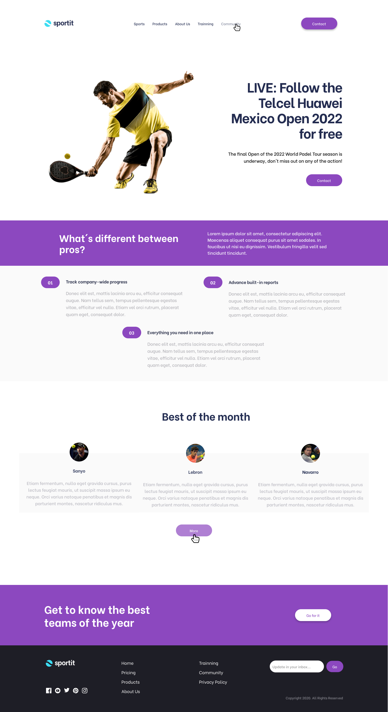
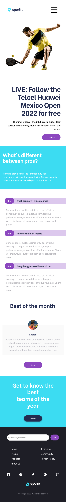

# Desafío Clase 14 | Previa Evaluación Final

## Desafío:

Realizar el maquetado propuesto y aplicar los conocimeintos adquiridos referentes a animaciones con CSS.

## Proyecto Final

Se propone iniciar con el desarrollo del entregable final de la asignatura de acuerdo con el siguiente diseño en [Figma](https://www.figma.com/file/9vpyo8MNQzrZjleW2ZshuE/12-22-FE1?type=design&node-id=0-1&mode=design)

Diseño desktop (ancho mínimo: 1440px)

Diseño mobile (ancho máximo: 480px)
