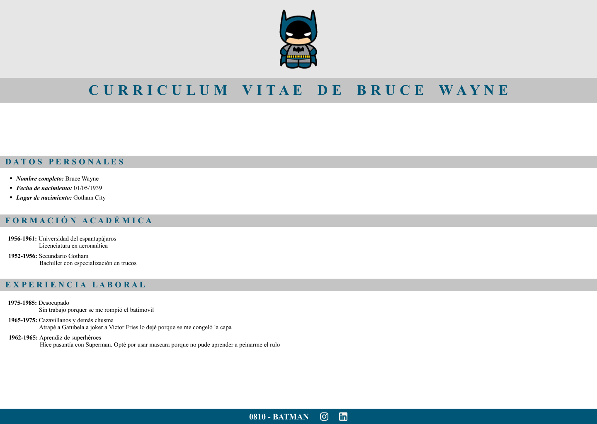

# Desafío Clase 16

## Desafío:

Tomando guía el trabajo CV-Batman de la clase 7, crearemos esos estilos nuevamente utilizando el preprocesador Sass, visto en esta clase. Tené en cuenta renombrar tu CSS anterior para no perderlo.  

Diseño de la práctica realizada en la clase C5S:

