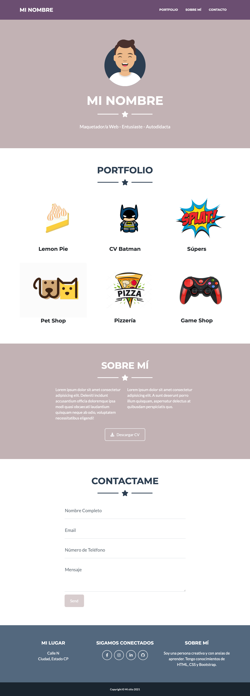
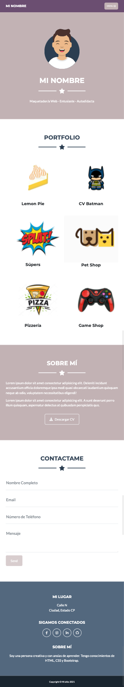
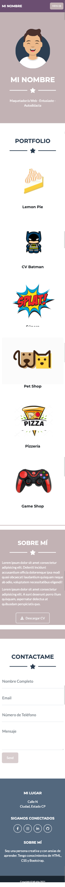
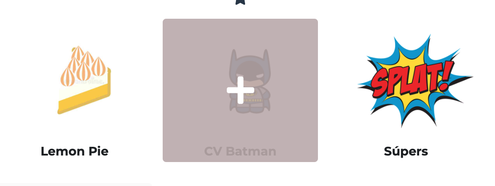
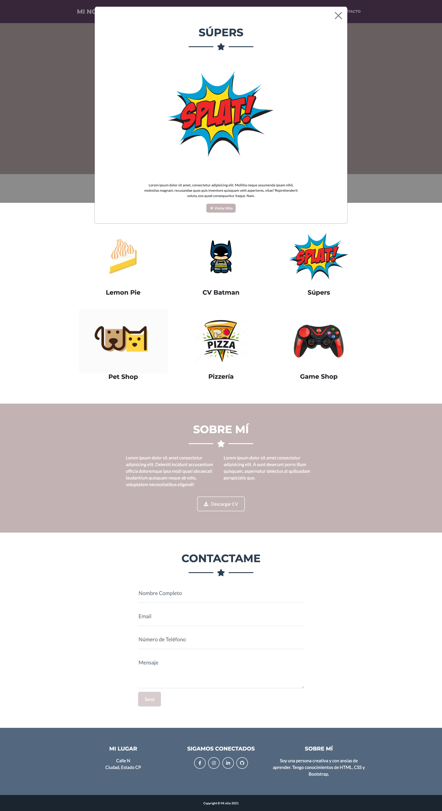

# Desafío Clase 18

## Desafío:

Tomando como referencia los diseños desarrollados para este desafío, comenzaremos a utilizar los componentes y layouts de Bootstrap para armar un portfolio en línea. Tambíen estan disponibles las imágenes necesarias.

### A tener en cuenta:
* Debe adaptarse a mobile y desktop como indican los bocetos.
* Cada card de la sección portfolio tiene un efecto hover y además con el evento
click abrimos un modal. Cada card debe tener su propio modal.
* Se pueden utilizar otras imágenes si se desean. El tamaño de las mismas es de
900pxX650px
* Recordar crear clases propias para los cambios de estilos.
* Enlazar las CDN tanto de css como js.
* Recurrir siempre a la documentación.

### Diseños:

