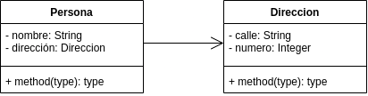
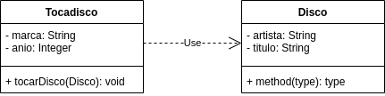
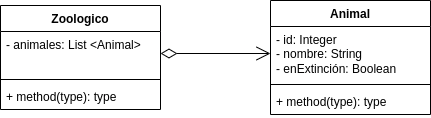
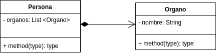

# Relaciones entre clases

## Tipos de relaciones
* Asociación (***tiene ...***)  
  Va en un solo sentido: una clase *A* conoce a una clase *B*, pero la clase *B* **NO** conoce a la clase *B*
  

  *Relación de uso (de dependencia)*  
  Una clase hará solamente el **uso** de otra clase sin que sea parte de la propia clase. Generalmente una clase se *pasa* como parámetro a uno de los métodos de la otra clase
  

* Agregación (***tiene un(a)...***)  
  Cuando ambas clases son independientes una de la otra, es decir, tienen relación, pero pueden existir de forma individual.
  

* Composición (******)  
  Cuando por lo menos, una de las clases depende de otra clase (una no tiene *sentido* de existir sin la otra).
  
* Generalización  
* Especialización  